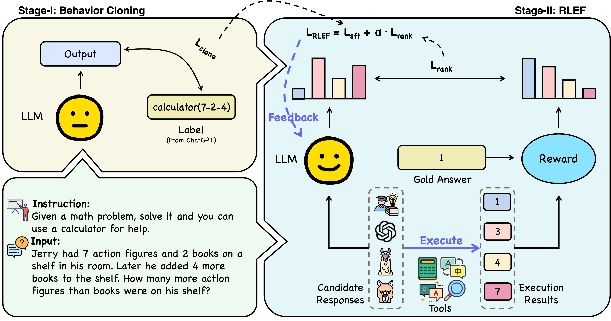
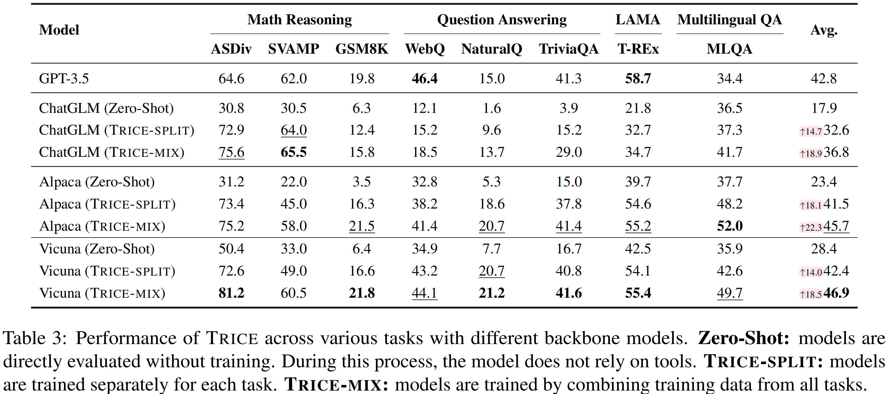
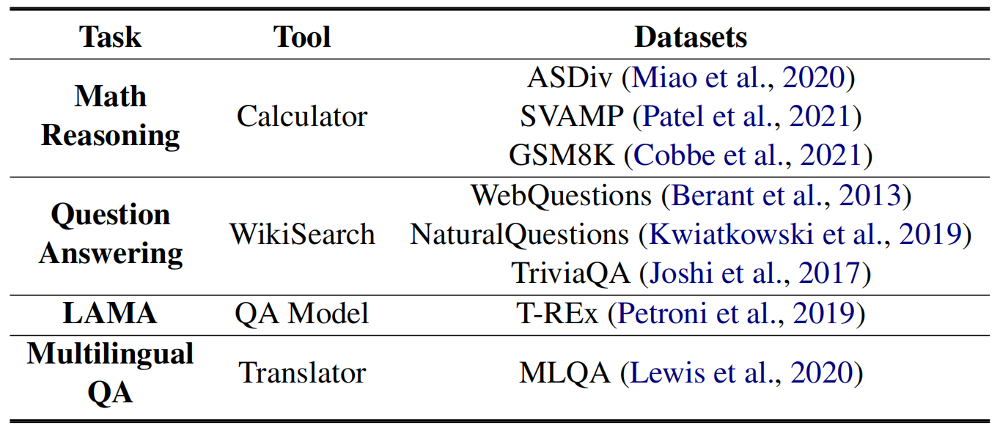
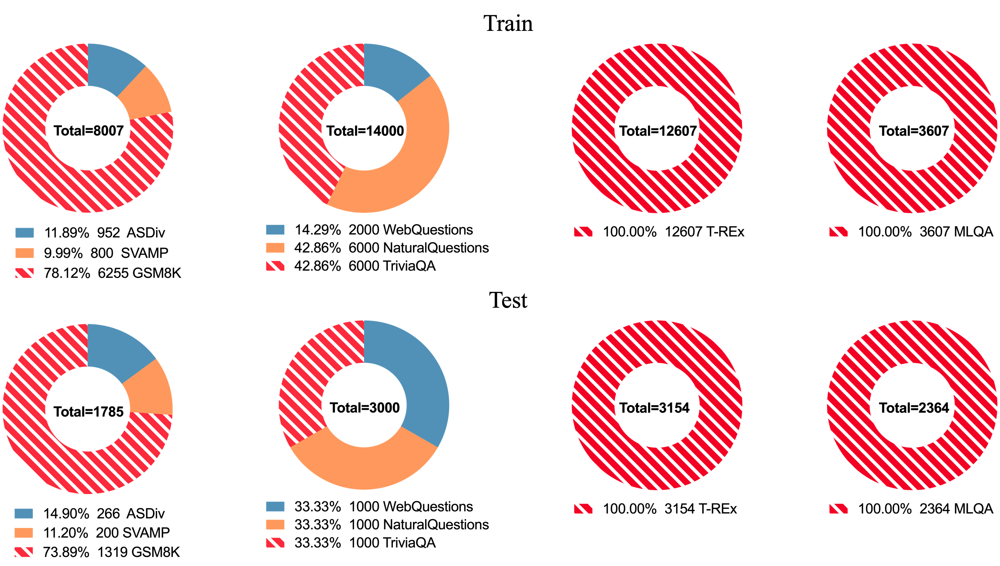

# TRICE

Code and datasets for the paper "[Making Language Models Better Tool Learners with Execution Feedback](https://arxiv.org/abs/2305.13068)".

## 🔔 News

- We upload a [tutorial](./tutorial/tutorial.pdf) entitled "From Chain-of-Thought to LLM Powered Autonomous Agent".

## Quick Links

* [TRICE](#TRICE)
  * [Overview](#overview)
  * [Requirements](#requirements)
  * [Tasks and Datasets](#tasks-and-datasets)
    * [Data Generation](#data-generation)
  * [Train](#train)
    * [Training Stage1](#training-stage1)
    * [Training Stage2](#training-stage2)
  * [Evaluate](#evaluate)
  * [Citation](#citation)

## Overview


In this paper, we focus on addressing the challenge of selective utilization of tools by LLMs and propose a two-stage end-to-end training framework dubbed **TRICE** (**T**ool Lea**R**ning w**I**th Exe**C**ution F**E**edback) to make LLMs better tool learners with execution feedback. An overview of our proposed training method can be seen as follows:



In stage-1 (**Behavior Cloning**), we conduct instruct-tuning on the dataset to let the model imitate the tool-using behavior.  In stage-2 (**RLEF**), we further reinforce the model with tool execution feedback by aligning it with desirable candidate responses. The performance of TRICE across various tasks with different backbone models is as follows:



## Requirements

```bash
pip install -r requirements.txt
```

## Tasks and Datasets

We mainly evaluate our method on four tasks with each task specified to an external tool.



Due to limited computational resources, we randomly sample train and test sets from each dataset to reduce the data scale. **We release the mixed training data for Vicuna-7B and the test set for each task in [Google Drive](https://drive.google.com/drive/folders/1rqBrVcOl1ykFDd7g71xNwt9Q194L67DJ?usp=sharing).** We display the detailed data distribution for each task as follows:



### Data Generation

Given the lack of gold tool API labels, we utilize ChatGPT to automatically generate tool APIs for training stage-1. For training stage-2, we collect five responses for each question from four different models, e.g. ChatGPT, InstuctGPT, Vicuna-7B, Alpaca-7B, and the output of the training data in Behavior Cloning stage as the pseudo-human-expert response. For the detailed data generation process, please refer to [here](https://github.com/zjunlp/TRICE/tree/main/generate_data).

The generated data should be placed under the `data` folder with the following structure:

```
data
 |-- raw  # original dataset
 |    |-- math
 |    |    |-- math.json  # all the data for this task
 |    |    |-- GSM8K_right.json  # questions with right answers
 |    |    |-- GSM8K_wrong.json  # questions with wrong answers
 |    |    |-- ...  # other datasets
 |    |-- ...  # other tasks
 |-- stage1  # training data for stage1
 |    |-- math
 |    |    |-- math.json  # all the training data for this task (can be directly used to train)
 |    |-- ...
 |    |-- mix  # mixed training data for all tasks
 |-- stage2  # training data for stage2
 |    |-- math
 |    |    |-- math.json  # all the training data for this task (can be directly used to train)
 |    |    |-- math_gold_response.json
 |    |    |-- math_chatgpt_response.json
 |    |    |-- math_davinci_response.json
 |    |    |-- math_vicuna_response.json
 |    |    |-- math_alpaca_response.json
 |    |-- ...
 |-- dev  # test dataset for each task
 |    |-- math
 |    |    |-- math.json
 |    |-- ...
```

## Train

**We train all the models with [LoRA](https://arxiv.org/pdf/2106.09685.pdf).** Here we release the code to train [Vicuna](https://github.com/lm-sys/FastChat) and [Alpaca](https://github.com/tatsu-lab/stanford_alpaca) (thanks to the [alpaca-lora](https://github.com/tloen/alpaca-lora) and [RRHF](https://github.com/GanjinZero/RRHF) program). For code to train [ChatGLM](https://github.com/THUDM/ChatGLM-6B), you can refer to [here](https://github.com/mymusise/ChatGLM-Tuning) for help.

### Training Stage1

In stage 1, we train the model in an instruct-tuning manner.

```bash
cd train
python train_stage1.py \
    --base_model ../PLMs/vicuna-7b \
    --data_path ../data/stage1/math/math.json \
    --output_dir vicuna-lora/stage1/math \
    --batch_size 1024 \
    --micro_batch_size 128 \
    --num_epochs 5 \
    --learning_rate 1e-4 \
    --cutoff_len 512 \
    --prompt_template_name vicuna  # set to 'alpaca' for Alpaca-7B
```

### Training Stage2

In stage 2, we train the model by reinforcement learning based on the execution feedback.

```bash
cd train
python train_stage2.py \
    --model_name_or_path ../PLMs/vicuna-7b \
    --resume_from_checkpoint vicuna-lora/stage1/math \
    --data_path ../data/stage2/math.json \
    --fp16 True \
    --output_dir vicuna-lora/stage2/math \
    --num_train_epochs 2 \
    --per_device_train_batch_size 8 \
    --per_device_eval_batch_size 8 \
    --gradient_accumulation_steps 32 \
    --evaluation_strategy "no" \
    --save_strategy "steps" \
    --save_steps 10 \
    --save_total_limit 100 \
    --learning_rate 2e-5 \
    --lr_scheduler_type "cosine" \
    --logging_steps 1 \
    --model_max_length 512 \
    --rrhf_weight 1 \
    --remove_unused_columns False
```

🍓We provide the best LoRA checkpoint for Vicuna-7B at [Google Drive](https://drive.google.com/drive/folders/14-pl8Vkx2_ohn53fgnLFHCE7OpxK9YgE?usp=sharing).

## Evaluate

Before evaluating the model on the test set, you should first generate the response.

```bash
cd evaluate
python generate.py \
    --base_model ../PLMs/vicuna-7b \
    --task math \
    --data_path ../data/dev/math/math.json \
    --lora_weights ../train/vicuna-lora/stage2/math \
    --output_path ../data/dev/math/math_response.json \
    --prompt_template vicuna
```

Then evaluate the model performance based on the generated responses.

```bash
python evaluate.py \
    --task math \
    --model vicuna \
    --lora_weights ../train/vicuna-lora/stage2/math \
    --data_path ../data/dev/math/math_response.json \
    --target_path ../data/dev/math/math_result.json
```

## Citation

If you use or extend our work, please cite the paper as follows:

```bibtex
@article{qiao2023trice,
  author       = {Shuofei Qiao and Honghao Gui and Qianghuai Jia and Huajun Chen and Ningyu Zhang},
  title        = {Making Language Models Better Tool Learners with Execution Feedback},
  journal      = {CoRR},
  year         = {2023},
  eprinttype   = {arXiv},
  eprint       = {2305.13068},
}
```

